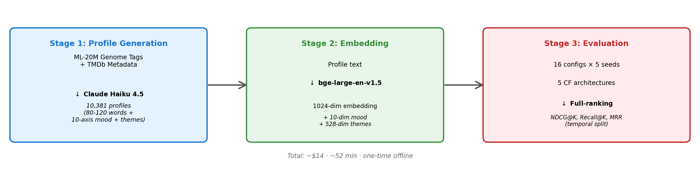

# LLM-MovieLens: A Density-Paradigm Framework with Class-Level Triangulation for LLM-Augmented Collaborative Filtering

<p align="center">
  <strong>Anonymous Authors</strong> &nbsp;|&nbsp;
  <a href="https://huggingface.co/datasets/anonyauthor4review/llm-movielens">Dataset</a>
</p>

<p align="center"><em>Paper PDF available to reviewers via the conference submission system (CIKM 2026 Full Research Track, under double-blind review).</em></p>

[](LICENSE)
[](https://www.python.org/downloads/)
[](https://huggingface.co/datasets/anonyauthor4review/llm-movielens)
[](https://cikm2026.org/)

> **An extensible testbed for LLM-augmented recommendation: paradigm choice splits by dataset density.**

LLM-MovieLens is a dataset and testbed for LLM-augmented collaborative filtering. We release 10,381 LLM-synthesised profiles for ML-20M, parallel cross-density profile sets for Amazon-Books-2018 (9,289 profiles) and an ML-1M subset (2,788 profiles for 2,807 post-10-core items, drawn from the ML-20M pack), pre-computed embeddings under multiple encoders, and a 16-config benchmark suite under a density-paradigm framework with a path-override extension pattern.

<p align="center">
  
</p>

## Paper at a glance

This section is the single ground-truth entry point. It lists the paper's contributions, research questions, experimental protocol, configurations, and headline results in one scrollable page, and points to where each claim is verified in the artifact.

### What the paper claims (3 contributions)

1. **Density-paradigm framework for LLM-for-RecSys.** Content-augmentation methods organise into three classes — *regularizers* (aux-loss), *replacers* (content-driven embeddings), *injection* (additive content bias) — plus an orthogonal *sequential* axis. The regularizer-vs-injection gap is **monotone in 1/density** across four datapoints (90× density range, same-domain control included), corroborated by two structurally-different regularizer instantiations. Falsifiable cross-density hypothesis.
2. **Released artifact (testbed).** 10,381 ML-20M profiles + parallel 9,289 Amazon-Books and 2,788 ML-1M subset; multi-encoder embeddings; 16 model configs + Tier-3 / Tier-3+ baselines; 500-profile 3-annotator human evaluation; full training/eval infrastructure.
3. **Within-ML-20M ablations and a controllable-recommendation primitive.** LLM profiles beat genome (both PCA-128d and raw-1128d, ruling out dimensionality), beat BERT-on-title at the same encoder (isolating reasoning), and beat pure CF including XSimGCL — all at *p* < 0.05; rankings preserved under GPT-4o-mini retrain (residual −0.73%, *p*=0.026). The 10-axis structured mood vector enables tasks beyond top-K NDCG: 30.8% zero-shot axis-conditioned retrieval; 8.2× / 92× per-dim Recall@1000 efficiency over genome-PCA / BERT-on-title on medium-bucket items; cross-LLM-stable on 4/10 axes (Pearson *r* ≥ 0.7 between Claude Haiku 4.5 and GPT-4o-mini).

### Research questions and answers

7 RQs, organised into pre-specified ML-20M ablations (Q1–Q4), cross-density synthesis (Q5–Q6), and robustness (Q7).

| RQ | Question | Finding (NDCG@10) | Where |
|---|---|---|---|
| **Q1** | Does LLM content beat pure CF (incl. strongest contrastive)? | **+3.0%** vs M1 (*p*=0.004); **+2.6%** vs XSimGCL/M1c (*p*=0.010) | paper §5 |
| **Q2** | Does LLM-synthesised content beat genome tags? (central claim) | **+2.5%** at PCA-128d (*p*=0.001); **+2.9%** at raw-1128d (*p*=0.022, rules out dimensionality) | paper §5 |
| **Q3** | Does LLM reasoning matter vs naive BERT-on-title? | **+3.3%** (*p*=0.002, same-encoder fair comparison) | paper §5 |
| **Q4** | Does adding mood help beyond profile alone? | NDCG@10 / Recall@10 statistically null; MRR +1.0% (*p*=0.061, marginal). Mood positioned as a controllability primitive (part of contribution 3). | paper §5 |
| **Q5** | Does paradigm choice depend on density? (central finding) | **Yes**: regularizer-vs-injection chain monotone in 1/density. R1-gene −1.1% / +3.7% / +17.0% / +29.5%; R1-plus −5.6% / +10.9% / +16.3% / +26.4% across ML-20M / sub-ML-20M / ML-1M / Amazon. Replacers (R2, R3) never beat M7; collapse at sparse. Injection density-robust. | paper §5 Q5 + Fig. density_chain |
| **Q6** | Does sequential's density decay differ from the content paradigms? | **Yes**: SASRec ties M7 on dense ML-20M (+0.2%), then decays steepest of any paradigm — 6.8× ML-20M→Amazon (vs M7's 2.1×). | paper §5 Q6 |
| **Q7** | Robust to encoder and LLM provider? | **Yes**: e5-large-v2 ≤1.3% NDCG@10 spread; GPT-4o-mini residual on M4 −0.73% (*p*=0.026, Claude>GPT every seed), an order of magnitude below the M4-over-baseline gap. (Platform + per-dataset retuning robustness in App.) | paper §5 Q7 + Apps |

### Experimental protocol

| Axis | Setting | Note |
|---|---|---|
| **Density datapoints** | 4: ML-20M (1,160 int/item), subsampled-ML-20M (225, same-domain control), ML-1M (163), Amazon-Books-2018 (13) | 90× density range; the subsampled-ML-20M datapoint disentangles density from domain |
| **Methods** | 16 paper-canonical configs in Table 4 (14 M-configs M0–M9, M1b–d, M2b + R1 + R2) + 3 additional Tier-3 / Tier-3+ comparators in cross-density / triangulation appendices (R1-plus, R3, SASRec) | M-configs + R1/R2 evaluated on ML-20M; R1-gene + R1-plus on 4 datapoints; **R2 + R3 also on all 4 datapoints (incl. subsampled-ML-20M same-domain control)**; SASRec on 4 (orthogonal axis) |
| **Seeds** | 5: 42, 123, 456, 789, 2026 | Identical seed set across all methods × datapoints |
| **Metrics** | NDCG@10, Recall@10, MRR (full-ranking eval over the entire item catalog) | No sampled evaluation — see paper App. for protocol-vs-sampled-eval gap discussion |
| **Significance** | Paired *t*-test (scipy.stats.ttest_rel) on 5 paired per-seed values | Bands: *** *p* < 0.001, ** *p* < 0.01, * *p* < 0.05, n.s. *p* ≥ 0.05 |
| **Selection metric** | RLMRec (R1, R1-plus): val Recall@20, patience=5 (upstream-native). LightGCN-SF (M2–M9, R2, R3): val NDCG@10, patience=20. SASRec: pmixer upstream criterion. | Each method uses its own upstream selection criterion; intentional asymmetry, disclosed in paper App. tier3_hparams. |
| **Sentence encoder** | Primary: bge-large-en-v1.5 (1024-dim, BAAI). Cross-encoder validation: e5-large-v2 (Q7). | M3/M4/M7/M8 only re-run under e5 — see paper App. encoder_sens for why other configs don't need re-running |
| **LLM provider** | Primary: Claude Haiku 4.5 (Anthropic). Cross-LLM validation: GPT-4o-mini (Q7, cost-tier-matched). | M4/M7 only re-trained under GPT — see paper App. cross_llm_downstream for why R1/R2/R3 inherit |
| **Capacity-matching** | Shared backbone *d*=128 for M0–M9, R2, R3 and R1-gene / R1-plus on ML-20M; *d*=32 for R1-gene / R1-plus on sub163 / ML-1M / Amazon (RLMRec's upstream-native dimension) | The *d*=32 retention on sparse datapoints is conservative: regularizer-strengthens-with-capacity, so *d*=128 would widen the win at sparse, not threaten the chain |

### Configurations table

Compact one-line-per-config summary. Full method-architecture text lives further down under "Model Configurations".

| Tier | Config | Architecture | Feature input | Where in paper |
|---|---|---|---|---|
| 1 (pure CF) | M0 | BPR-MF | ID only | Table 4 |
| 1 | M1 | LightGCN | ID only | Table 4 |
| 1 | M1b / M1c / M1d | SimGCL / XSimGCL / LightGCL | ID only, contrastive | Table 4 |
| 2 (content-aug.) | M2 | LightGCN-SF | Genome PCA-128d | Table 4 |
| 2 | M2b | LightGCN-SF | Genome raw-1128d (dimensionality control) | Table 4 |
| 2 | M3 | LightGCN-SF | BERT(title+genre), 1024d (same encoder as M4) | Table 4 |
| 2 | **M4** | LightGCN-SF | **LLM profile (1024d)** ← core contribution | Table 4 |
| 2 | M5 | LightGCN-SF | LLM mood (10d) | Table 4 |
| 2 | M6 | LightGCN-SF | LLM themes (528d) | Table 4 |
| 2 | **M7** | LightGCN-SF | **LLM profile + mood (1034d)** ← best overall | Table 4 |
| 2 | M8 | LightGCN-SF | All LLM (profile + mood + themes, 1562d) | Table 4 |
| 2 | M9 | LightGCN-SF | Genome PCA-128 + mood + themes (666d) | Table 4 |
| 3 (LLM-for-RecSys) | R1 | RLMRec-gene | Aux-loss regularizer (generative reconstruction) | Table 4, density chain |
| 3 | **R1-plus** | RLMRec-plus | Aux-loss regularizer (contrastive distillation, 2nd instantiation) | density chain |
| 3 | R2 | KAR-style MoE | Replacer (4-expert hybrid-expert adapter + softmax gate) | Table 4 |
| 3 | R3 | HypernetReplacer | Replacer (pure content→embedding, no gating, 2nd instantiation) | App. r3_triangulation |
| 3+ | SASRec | pmixer/SASRec.pytorch | Sequential, ID-only (orthogonal axis) | App. cross_domain |

### Headline numbers (verifiable from this repo in 60s)

```
python3 reproducibility/verify_headline_numbers.py
→ ALL CHECKS PASSED. Released artifact reproduces every headline number in the paper.
```

Verifies **53 paper-canonical cells**: 12 configs × 2 metrics (NDCG@10 + MRR) minus R3's unreported MRR = 23 in Table 4 + 11 paired-*t* tests in Table 11 + 8 density-chain endpoints + 8 replacer cross-density + 3 SASRec cross-density.

| Domain | Headline | Where to verify |
|---|---|---|
| ML-20M Table 4 winner | M7 NDCG@10 = **0.1175 ± 0.0004** | `code/benchmark/results/m7/` per-seed + verifier §1 |
| Central within-ML-20M claim | M4 > M2 (+2.5%, *p* = 0.001) | verifier §2 |
| Central cross-density claim | R1-gene chain monotone in 1/density: **−1.1% → +3.7% → +17.0% → +29.5%** vs M7 | `code/benchmark/results*/r1*_metrics.json` + verifier §3 |
| Triangulation by 2nd instantiation | R1-plus chain: **−5.6% → +10.9% → +16.3% → +26.4%** vs M7 | `code/benchmark/results*/r1plus*_metrics.json` + verifier §3 |
| Replacer collapse at sparse | R2 −22.0% (retuned) / R3 −11.7% on Amazon | verifier §4 |
| Sequential decay endpoint | SASRec 6.8× ML-20M → Amazon drop (steepest of any paradigm) | verifier §5 |
| Sensitivity (cross-LLM) | M4 cross-provider residual −0.73% (*p* = 0.026), order of magnitude below M4-over-baseline | paper App. cross_llm_downstream |

### Material uploaded to HF / GH — ground-truth checklist

| What | Where | Verified by |
|---|---|---|
| 10,381 ML-20M LLM profiles (Claude Haiku 4.5 + GPT-4o-mini) | HF `profiles/ml20m/` | Croissant metadata + SHA256SUMS |
| 9,289 Amazon-Books profiles | HF `profiles/amazon_books_2018/` | SHA256SUMS |
| Multi-encoder embeddings (bge / e5 / gte / nomic / MiniLM / mpnet) | HF `embeddings/` | SHA256SUMS |
| Per-seed checkpoints (M0–M9, R1, R1-plus, R2, R3, SASRec × 4 datapoints) | GH `code/benchmark/checkpoints*/` | symlink view at `reproducibility/artifacts/<method>/<datapoint>/` (18 cells, all resolve) |
| Per-method aggregate test metrics | GH `code/benchmark/results*/r{1,1plus,2,3}_<dataset>_metrics.json` | `REPRODUCTION_INDEX.md` + `verify_headline_numbers.py` |
| Grid-selection manifests + per-seed winner JSONs | GH `code/benchmark/hparams/r{1,2,3}/grid_selection.json` + `<dataset>_winner_seed<N>.json` | inspected directly |
| Human evaluation (500 profiles × 3 annotators × 5 axes + 100 mood pairwise) | HF `human_eval/` | paper Table 3 + App. C |
| Cross-LLM (GPT-4o-mini) artifacts | HF `profiles/ml20m/gpt-4o-mini/` + GH `code/benchmark/checkpoints_ml20m_gpt4omini/` | paper Table 8 + verifier (M4 cell) |
| Croissant dataset metadata | HF `metadata.json` + GH `croissant.json` | `python -m mlcroissant validate croissant.json` |

## For Reviewers — Where to Find What

If you are looking for a specific artifact, start here.

| If you want to … | Go to |
|---|---|
| See every critical checkpoint + result file at a glance (one table) | [`REPRODUCTION_INDEX.md`](REPRODUCTION_INDEX.md) — auto-generated by `scripts/build_artifact_index.py` |
| Verify Table 4 (main results) + Table 11 (significance tests) in <30 s on a laptop, no GPU | `python3 reproducibility/verify_headline_numbers.py` |
| Inspect a single (method, datapoint) cell | `reproducibility/artifacts/<method>/<datapoint>/` (symlink view: checkpoints/seed-*.pt, result.json) |
| See grid selection for R1-gene, R1-plus, R2, R3 | `code/benchmark/hparams/r{1,2,3}/grid_selection.json` (+ per-dir `README.md`) |
| Get per-seed metric files (R1/R2/R3 × ML-20M / sub163 / ML-1M / Amazon) | `code/benchmark/results*/r{1,1plus,2,3}_<dataset>_metrics.json` (ML-20M files unsuffixed; others `_ml20m_sub163` / `_ml1m` / `_amazon`) |
| Find raw RLMRec encoder checkpoints | `code/benchmark/external/RLMRec/encoder/checkpoint/*.pth` (upstream-native location; project `.pt` copies under `checkpoints*/r1/`) |
| Regenerate `density_chain.pdf` | `python3 scripts/plot_density_chain.py` |
| See the dataset card + Croissant metadata | HuggingFace mirror (linked above) |
| Read the full dataset documentation | [`docs/DATASHEET.md`](docs/DATASHEET.md) |

**Naming convention**: ML-20M (base) artifacts live in unsuffixed `checkpoints/` and `results/`; other datapoints use `_ml20m_sub163` / `_ml1m` / `_amazon` suffixes.

**Capacity-ablation note**: R1-gene and R1-plus on ML-20M are capacity-matched to $d{=}128$ (shared LightGCN-SF backbone); the prior $d{=}32$ R1-plus run is retained internally as a capacity-ablation reference and is not part of the released artifact. (Both replacers R2 + R3 are now evaluated on all four density datapoints including the subsampled-ML-20M control — see the cross-density chain.)

### Selection-protocol matrix (per method × datapoint)

What hyperparameter source / search budget was used for each Tier-3 / Tier-3+ cell.

| Method | ML-20M (1,160 int/item) | sub-ML-20M (225) | ML-1M (163) | Amazon-Books (13) |
|---|---|---|---|---|
| **R1-gene** (regularizer) | 54-pt grid, $d{=}128$ ([`hparams/r1/`](src/benchmark/hparams/r1/)) | upstream RLMRec-pattern, $d{=}32$ | upstream RLMRec-pattern, $d{=}32$ | upstream RLMRec authors' published Amazon-Book hparams, $d{=}32$ |
| **R1-plus** (regularizer) | upstream RLMRec-plus defaults, capacity-matched to $d{=}128$ | upstream RLMRec-plus-pattern, $d{=}32$ | upstream RLMRec-plus-pattern, $d{=}32$ | upstream + depth-controlled re-run (ln=2 vs ln=3), $d{=}32$ |
| **R2** (replacer) | 18-pt grid ([`hparams/r2/`](src/benchmark/hparams/r2/)), $d{=}128$ | 4-cell pre-registered retune | 4-cell pre-registered retune | 4-cell pre-registered retune |
| **R3** (replacer) | 4-cell grid ([`hparams/r3/`](src/benchmark/hparams/r3/)), $d{=}128$ | 4-cell pre-registered retune | 4-cell pre-registered retune | 4-cell pre-registered retune |
| **SASRec** (sequential, orthogonal axis) | pmixer upstream defaults | pmixer upstream defaults | pmixer upstream defaults | pmixer upstream defaults |

Three structural notes a careful reviewer will care about:

1. **R1-gene and R1-plus have disjoint aux-loss hparam sets** (gene: `mask_ratio` / `recon_weight` / `re_temperature`; plus: `kd_weight` / `kd_temperature`) — no symmetric grid exists. `embedding_size` is the one knob both methods share; we equalize it ($d{=}128$) on ML-20M only, where capacity fairness against M7 is load-bearing. See paper App. `tier3_hparams`.
2. **R1-plus is an un-tuned corroborator** of R1-gene's chain. The fact that the monotone-in-$1/\text{density}$ chain emerges at upstream-default R1-plus hparams (no grid) is epistemically stronger than a tuned match would be: it rules out tuning-artifact explanations.
3. **R2 and R3 are evaluated on all four datapoints**, including the subsampled-ML-20M same-domain control where both lose to M7 (R2 $-5.1\%$, $p<0.01$; R3 $-3.9\%$, $p<0.001$; 5/5 seeds same-sign each). This completes the replacer-class triangulation across the full chain alongside the regularizer class — both content paradigm classes are now two-instantiation triangulated at every density datapoint.

## Key Findings

5-seed mean ± std (seeds: 42, 123, 456, 789, 2026), bge-large-en-v1.5 encoder, paired $t$-tests.

### Within ML-20M (controlled ablations)

| Research Question | Comparison | NDCG@10 | Result |
|---|---|---|---|
| LLM content vs pure CF | M4 vs M1 (LightGCN) | 0.1173 vs 0.1139 | **+3.0%** ($p=0.004$) |
| LLM content vs strongest CF | M4 vs M1c (XSimGCL) | 0.1173 vs 0.1144 | **+2.6%** ($p=0.010$) |
| LLM vs genome PCA-128d | M4 vs M2 | 0.1173 vs 0.1145 | **+2.5%** ($p=0.001$) |
| LLM vs genome raw-1128d | M4 vs M2b | 0.1173 vs 0.1140 | **+2.9%** ($p=0.022$, rules out dimensionality) |
| LLM reasoning vs BERT (same encoder) | M4 vs M3 | 0.1173 vs 0.1136 | **+3.3%** ($p=0.002$) |
| Mood adds top-rank precision only | M7 vs M4 | 0.1175 vs 0.1173 | NDCG@10/Recall@10 tied; MRR +1.0% ($p=0.061$, marginal) |

### Cross-density paradigm framework ($90\times$ density range)

| Method | ML-20M (1,160 int/item) | sub-ML-20M (225) | ML-1M (163) | Amazon-Books (13) |
|---|---|---|---|---|
| R1 RLMRec-gene **vs M7** | $-1.1\%$ ($p=0.007$) | **$+3.7\%$** ($p=0.014$) | **$+17.0\%$** | **$+29.5\%$** |
| R1-plus contrastive **vs M7** | $-5.6\%$ ($p{=}3{\times}10^{-5}$) | **$+10.9\%$** ($p<0.001$) | **$+16.3\%$** | **$+26.4\%$** |
| R2 KAR-style replacer **vs M7** | $-2.6\%$ ($p=0.013$) | $-5.1\%$ ($p<0.01$) | n.s. tie | **$-22.0\%$** (retuned) |
| R3 HypernetReplacer **vs M7** | $-6.5\%$ ($p=0.021$) | $-3.9\%$ ($p<0.001$) | n.s. tie | **$-11.7\%$** |
| SASRec **vs M1** (sequential) | $+3.3\%$ (ties M7) | $-2.2\%$ (n.s.) | $-11.7\%$ | $-48.5\%$ |

**Central methodological finding:** paradigm choice splits by per-item density. Across our four datapoints, aux-loss regularizers (R1-gene, R1-plus) gain monotonically with sparsity; capacity replacers (R2, R3) collapse at sparse-per-user density; additive injection (M4, M7) is density-robust; sequential models (SASRec) form an orthogonal fourth axis with the steepest dense-to-sparse endpoint drop ($6.8\times$ ML-20M $\to$ Amazon-Books). Both content paradigm classes are triangulated by two structurally-different instantiations. The subsampled-ML-20M datapoint partially addresses the domain × density confound: density drops $5\times$ within the same domain, and the regularizer-vs-injection sign flips as the framework predicts.

**Robustness (4 axes):** encoder (e5-large-v2 preserves the M7$\geq$M4$\geq$M3$\approx$M8 ordering within $\leq 1.3\%$ NDCG@10); cross-LLM (5-seed GPT-4o-mini retrain preserves the M4-over-baseline ranking; residual M4 NDCG@10 effect is $-0.85\%$ at $p=0.014$, an order of magnitude below the M4-over-baseline gap); cross-platform (KAR Mac-MPS vs CUDA agree $\pm 0.002$ AUC); per-dataset retuning (R2 still loses on Amazon under a pre-registered 4-cell grid).

## Quick Start

> **Note for reviewers using the conference `supplementary.zip`:** scripts inside that bundle reference an older embedding directory name `bge-large-v1.5/`. The canonical name (matching the upstream BAAI model and the HuggingFace dataset layout) is `bge-large-en-v1.5/`. The scripts in **this repository** already use the canonical name. If you run the zip's scripts directly, either (a) clone this repo and use its scripts, or (b) `ln -s bge-large-en-v1.5 bge-large-v1.5` inside your local embedding directory. No retraining or re-evaluation is needed — only the path string differs.

### Installation

```bash
git clone https://github.com/anonyauthor4review-png/llm-movielens.git
cd llm-movielens
pip install -e ".[dev]"
```

### Download Data

```bash
# Download MovieLens 20M + our pre-computed features from HuggingFace
make download-data

# Or manually:
bash scripts/download_ml20m.sh
huggingface-cli download anonyauthor4review/llm-movielens --local-dir data/
```

### Run a Single Experiment

```bash
# BPR-MF baseline (no content features) — takes ~5 minutes on GPU
python -m benchmark.run_experiment --config M0 --seed 42

# LightGCN-SF + LLM profile (core contribution)
python -m benchmark.run_experiment --config M4 --seed 42

# Expected output (5-seed mean over 42, 123, 456, 789, 2026):
# Test NDCG@10: 0.1173 ± 0.0007 | Recall@10: 0.0498 ± 0.0007 | MRR: 0.2403 ± 0.0013
```

### Reproduce All Results

```bash
# Full ablation: 16 configs × 5 seeds (~24 hours on single A100)
make reproduce

# Or step by step:
make reproduce-tier1    # Pure CF baselines (M0, M1, M1b-d)
make reproduce-tier2    # Content-augmented (M2-M9)
make reproduce-tier3    # LLM-for-RecSys methods (R1 RLMRec-gene, R1-plus RLMRec-plus, R2 KAR-style, R3 HypernetReplacer)
make results-table      # Generate LaTeX table from results
```

## Three-Stage Pipeline

### Stage 1: Profile Generation

Claude Haiku 4.5 synthesizes 80-120 word embedding-optimized profiles for 10,381 movies, integrating top-30 genome tags + TMDb metadata. Cost: ~$14, runtime: ~52 min.

```bash
# Requires ANTHROPIC_API_KEY and TMDB_API_KEY
python -m profile_generator.main
```

<details>
<summary>Example profile: Toy Story (1995)</summary>

```json
{
  "movieId": 1,
  "title": "Toy Story (1995)",
  "profile_text": "A groundbreaking CGI-animated adventure exploring toy sentience and existential anxiety through buddy-comedy dynamics. Woody's jealousy arc and Buzz's identity crisis create surprisingly mature emotional stakes beneath family-friendly slapstick...",
  "mood_vector": [0.2, 0.8, 0.7, 0.6, 0.9, 0.3, 0.8, 0.4, 0.7, 0.6],
  "key_themes": ["identity crisis", "friendship loyalty", "technological wonder"]
}
```
</details>

### Stage 2: Embedding Generation

Profile text is encoded via bge-large-en-v1.5 (1024-dim). Additional features: mood vectors (10-dim), theme matrix (528-dim multi-hot), genome PCA baseline (128-dim), BERT title baseline (1024-dim).

```bash
# Generate all embedding types
python -m embedding_generator.main

# Use a different encoder
python -m embedding_generator.main --model gte-large-en-v1.5

# PCA sweep
python -m embedding_generator.main --pca-sweep
```

### Stage 3: Benchmark

16 configurations across 3 tiers, evaluated with full-ranking metrics (NDCG, Recall, HR, MRR) at K={10, 20, 50}.

```bash
# Single experiment
python -m benchmark.run_experiment --config M7 --seed 42

# Full ablation (all configs × 5 seeds)
python -m benchmark.run_ablation

# Cold-start analysis
python scripts/run_cold_start_5seeds.py
```

## Model Configurations

### Tier 1: Pure Collaborative Filtering

| Config | Model | Description |
|--------|-------|-------------|
| M0 | BPR-MF | Simplest CF baseline (dot-product) |
| M1 | LightGCN | Standard GNN CF baseline |
| M1b | SimGCL | Noise-based contrastive learning |
| M1c | XSimGCL | Cross-layer contrastive (strongest pure CF) |
| M1d | LightGCL | SVD-based contrastive learning |

### Tier 2: Content-Augmented LightGCN-SF

| Config | Features | Dims | Description |
|--------|----------|------|-------------|
| M2 | Genome PCA | 128 | Existing content baseline |
| M3 | BERT title | 1024 | Naive text encoding control |
| **M4** | **LLM profile** | **1024** | **Core contribution** |
| M5 | LLM mood | 10 | Structured mood signal |
| M6 | LLM themes | 528 | Multi-hot theme categories |
| **M7** | **Profile + mood** | **1034** | **Best overall configuration** |
| M8 | All LLM features | 1562 | Full feature set |
| M9 | Genome + mood + themes | 666 | Genome + structured LLM |

### Tier 3: LLM-for-RecSys Methods

| Config | Method | Paradigm class | Description |
|--------|--------|----------------|-------------|
| R1 | RLMRec-gene | Regularizer (aux-loss) | Generative reconstruction alignment |
| R1-plus | RLMRec-plus | Regularizer (aux-loss) | Contrastive distillation |
| R2 | KAR-style | Replacer (capacity) | MoE adapter with LLM knowledge |
| R3 | HypernetReplacer | Replacer (capacity) | Hypernetwork-conditioned item embeddings |

## Dataset Details

**Primary corpus — MovieLens 20M** (Harper & Konstan, 2015)
- 10,381 genome-covered movies, 127,371 users, 11.5M interactions; 1,160 int/item
- Temporal split: train (<2014-01-01), val (2014-H1), test (>2014-07-01)

**Cross-density partner corpora**
- **Subsampled ML-20M** (sub-ML-20M): 225 int/item — same domain, $5\times$ sparser per item; bridges the within-domain density confound
- **MovieLens 1M**: 2,807 post-10-core items, 163 int/item
- **Amazon-Books-2018**: 9,289 books (out of 9,332; 99.5% LLM-profile coverage), 13 int/item — sparse-domain endpoint

**Pipeline**
- **LLM:** Claude Haiku 4.5 (Anthropic); 99.5%+ valid-profile rate across corpora
- **Primary encoder:** bge-large-en-v1.5 (BAAI, 1024-dim); cross-encoder validation via e5-large-v2

Full datasheet: [docs/DATASHEET.md](docs/DATASHEET.md)

## Using Our Features in Your Own Model

```python
from datasets import load_dataset
import numpy as np

# Load from HuggingFace
ds = load_dataset("anonyauthor4review/llm-movielens")

# Or load embeddings directly
profiles = np.load("data/embeddings/bge-large-en-v1.5/profile_embeddings.npy")  # (10381, 1024)
moods = np.load("data/embeddings/bge-large-en-v1.5/mood_vectors.npy")           # (10381, 10)
themes = np.load("data/embeddings/bge-large-en-v1.5/theme_matrix.npy")          # (10381, 528)

# Movie ID mapping
import json
with open("data/embeddings/movie_id_index.json") as f:
    movie_ids = json.load(f)  # genome movieId ordering
```

## Citation

```bibtex
@inproceedings{anonymous2026llmmovielens,
  title={LLM-MovieLens: A Density-Paradigm Framework with Class-Level Triangulation for LLM-Augmented Collaborative Filtering},
  author={Anonymous},
  booktitle={Proceedings of the ACM International Conference on Information and Knowledge Management (CIKM)},
  year={2026},
  note={Under double-blind review}
}
```

## License

- **Code:** MIT License
- **LLM-generated profiles and embeddings:** CC BY 4.0
- **MovieLens 20M:** Subject to [GroupLens license](https://grouplens.org/datasets/movielens/)
- **TMDb metadata:** Subject to [TMDb Terms of Use](https://www.themoviedb.org/terms-of-use)

## About

Author identities are withheld during double-blind review. Affiliations and acknowledgments will appear in the camera-ready version.
