# Báo cáo thảo luận team
# Từ Density Law đến Soft Expert Composition:
# Giảng giải kết quả thí nghiệm hiện tại và kiến trúc từng nhánh

Date: 2026-06-03

Tài liệu này viết theo phong cách "giảng giải paper và hướng 2": ưu tiên trực giác,
sơ đồ, bảng kết quả, và kết luận có thể dùng để trao đổi nhanh với team. Mục tiêu
không phải thay thế các report chi tiết trong `docs/`, mà là gom lại câu chuyện
hiện tại: ta đã thử những gì, kiến trúc từng thí nghiệm ra sao, kết quả nói gì, và
còn thiếu gì nếu muốn nâng thành hướng 2 hoàn chỉnh.

## Cách đọc tài liệu này

Các thí nghiệm hiện tại đều nằm trên một giả định chung:

> Base recommenders đã được huấn luyện sẵn. Ta không train lại M7, R1, R1-plus.
> Ta chỉ xây một lớp meta phía trên score/cache để chọn, trộn, hoặc phân tích expert.

Vì vậy, câu hỏi chính không phải là "model CF nào tốt hơn?", mà là:

> Khi đã có nhiều paradigm LLM-for-RecSys, ta có thể khai thác density law bằng
> cách chọn/trộn expert tốt hơn một expert cố định hay không?

## 1. Bức tranh lớn

Paper gốc phát hiện một density law:

- Ở dữ liệu dày như ML-20M, injection/content-additive kiểu M7 rất mạnh.
- Khi mật độ giảm, regularizer kiểu R1/R1-plus tăng lợi thế.
- Replacer kiểu R2/R3 không trở thành winner ổn định và thường yếu ở sparse regime.

Hướng 2 trong tài liệu gốc muốn đi xa hơn: biến phát hiện mô tả đó thành một định
luật dự đoán được, ví dụ khớp các hàm `log`, `power`, `sigmoid`, tìm ngưỡng `d*`,
rồi dùng ngưỡng đó để chọn paradigm zero-shot.

Thí nghiệm hiện tại đi theo một nhánh gần hơn với triển khai:

> Thay vì hard-select một paradigm, ta dùng score cache từ M7/R1/R1-plus và học
> một lớp soft composition nhẹ phía trên.

Kết luận hiện tại:

> V2.2 dataset-level global blend là kết quả chính đáng báo cáo. Các router thích
> nghi hơn như V3/V3.1/V4 chưa vượt được V2.2, nhưng chúng tạo negative evidence
> hữu ích: adaptive routing có headroom oracle lớn nhưng rất dễ overfit.

## 2. Kiến trúc chung của toàn bộ pipeline

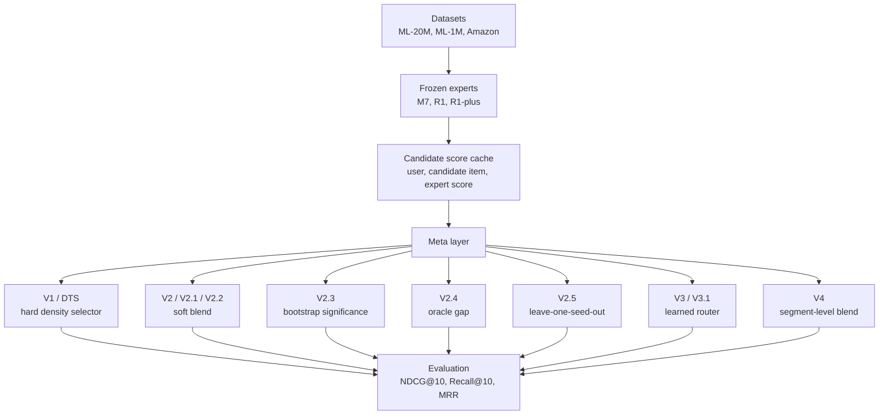

Hộp khái niệm: score cache

Score cache là bảng điểm đã tính sẵn của từng expert trên từng user-candidate pair.
Nó giúp ta thử nhiều router/blend rất nhanh mà không train lại recommender.

Trực giác: thay vì nấu lại ba món ăn từ đầu, ta đã có ba món trên bàn. Thí nghiệm
hiện tại chỉ học cách chọn hoặc phối ba món đó cho hợp ngữ cảnh.

## 3. Các expert nền

| Expert | Vai trò trong density law | Trực giác |
|---|---|---|
| M7 | Injection / additive content | Giữ ID embedding, cộng thêm content signal; mạnh ở dense regime |
| R1 | Regularizer / RLMRec-gene | Dùng content làm loss phụ; tốt dần khi dữ liệu thưa |
| R1-plus | Regularizer instantiation thứ hai | Tín hiệu regularizer bổ sung, đặc biệt hữu ích trên Amazon |

Lưu ý quan trọng:

- R2/R3 có trong paper gốc và density matrix, nhưng thí nghiệm meta-layer hiện tại
  tập trung vào M7/R1/R1-plus vì đây là ba expert deployable và có cache sẵn.
- Không nên viết rằng V2/V3 train lại M7/R1/R1-plus. Chúng chỉ operate trên score.

## 4. V1 / DTS: hard density threshold selector

### Câu hỏi

Nếu density law nói dữ liệu dày nên dùng M7, dữ liệu thưa nên dùng R1/R1-plus, vậy
một threshold đơn giản có đủ không?

### Kiến trúc

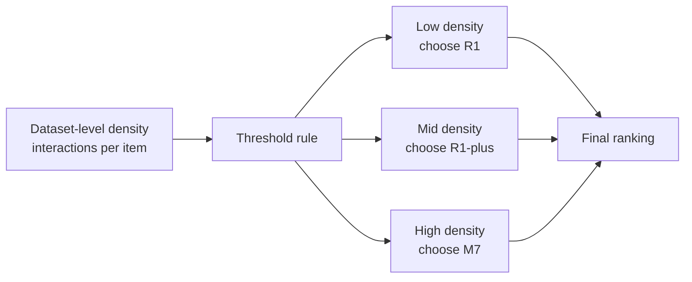

### Thiết kế

- Input: density ở mức dataset hoặc aggregate datapoint.
- Policy: hard select một expert theo ngưỡng.
- Output: ranking từ expert được chọn.
- Không dùng soft blend.

### Kết quả và ý nghĩa

V1/DTS hữu ích như diagnostic: nó cho thấy density là tín hiệu thật và có thể dùng
để phân biệt regime. Nhưng nó chưa đủ làm method chính vì:

- chỉ chọn một expert và bỏ mất tín hiệu phụ từ expert còn lại;
- nhạy với ngưỡng;
- dễ giống một heuristic hậu nghiệm nếu không có held-out domain.

Kết luận cho team:

> Giữ V1/DTS làm baseline/motivation, không dùng làm kết quả chính.

## 5. V2 candidate score cache: lớp dữ liệu bắt buộc

### Câu hỏi

Làm sao thử nhiều router/blend mà không train lại expert?

### Kiến trúc

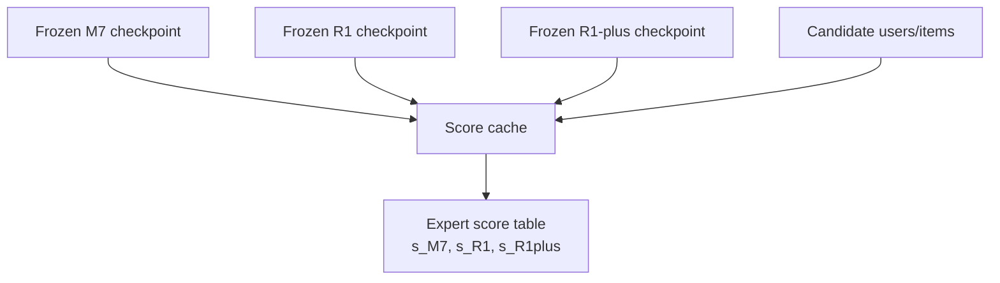

### Thiết kế

- Input: checkpoints, split, candidate items.
- Process: score từng candidate bằng từng expert.
- Output: bảng score dùng chung cho V2/V3/V4.

### Ý nghĩa

Đây là phần hạ tầng, không phải claim khoa học chính. Nhưng nó là điều kiện để
biến bài toán router/blend thành bài toán nhẹ, reproducible, và ít compute.

## 6. V2 / V2.1: soft blend bước đầu

### Câu hỏi

Thay vì chọn cứng một expert, nếu trộn score của M7/R1/R1-plus thì có tốt hơn không?

### Kiến trúc

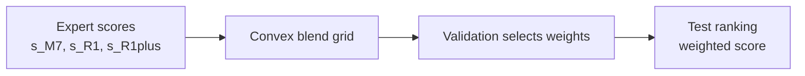

Công thức:

`score(u, i) = w_M7 * s_M7(u, i) + w_R1 * s_R1(u, i) + w_R1plus * s_R1plus(u, i)`

với:

`w_M7 + w_R1 + w_R1plus = 1`

### Thiết kế

- Input: score cache.
- Search: grid các bộ weight.
- Selection: validation NDCG@10.
- Output: test ranking bằng weighted score.

### Kết quả và ý nghĩa

V2/V2.1 cho thấy soft blend là hướng tốt hơn hard selector, nhưng per-seed weight
có thể overfit, đặc biệt trên ML-1M. Vì vậy V2.2 siết lại degree of freedom.

## 7. V2.2: dataset-level global blend

### Câu hỏi

Nếu chỉ chọn một bộ weight cho toàn dataset bằng mean validation qua 5 seeds, kết
quả có ổn định hơn không?

### Kiến trúc

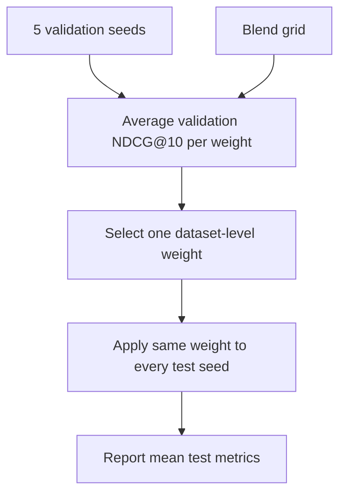

### Thiết kế

- ML-20M: M7-heavy grid.
- ML-1M: R1/R1-plus grid.
- Amazon: R1/R1-plus grid.
- Selection: `argmax mean_seed(validation NDCG@10)`.
- Tie-breaker: Recall@10, MRR.

### Kết quả chính

| Dataset | Weight `(M7, R1, R1-plus)` | V2.2 NDCG@10 | Best Expert | Delta |
|---|---|---:|---:|---:|
| ML-20M | `(0.70, 0.15, 0.15)` | 0.120126 | 0.117462 | +0.002664 |
| ML-1M | `(0.00, 0.60, 0.40)` | 0.195024 | 0.194915 | +0.000110 |
| Amazon | `(0.00, 0.60, 0.40)` | 0.076577 | 0.072953 | +0.003624 |

### Diễn giải

- ML-20M: M7 vẫn là trụ chính, nhưng R1/R1-plus thêm tín hiệu phụ có ích.
- Amazon: R1/R1-plus có tính bổ sung rõ, không cần M7.
- ML-1M: gần như trung tính; không nên claim significant improvement.

Hộp kết luận:

> V2.2 là main method hiện tại: đơn giản, deployable, có gain rõ trên ML-20M và
> Amazon, không train lại base recommenders.

## 8. V2.2 segment analysis: blend giúp ở đâu?

### Câu hỏi

V2.2 thắng do nhóm user/item nào, hay chỉ là ensemble trung bình?

### Kiến trúc

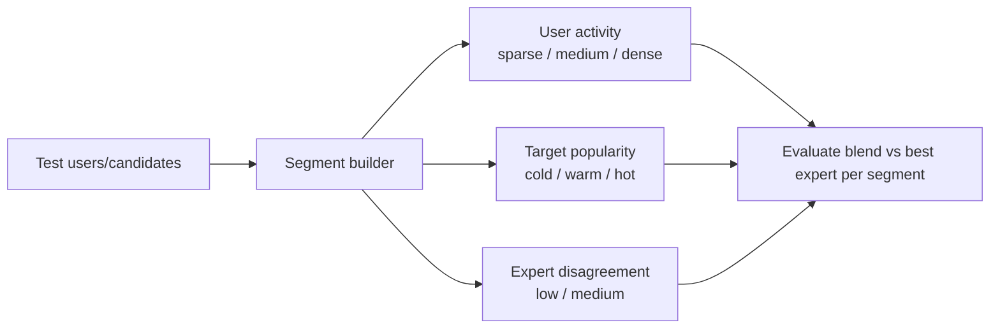

### Thiết kế

- Segment theo user history length.
- Segment theo target item degree.
- Segment theo disagreement giữa expert rankings.
- Dùng đúng V2.2 scoring rule.

### Kết quả chính

| Dataset | Segment | Delta NDCG@10 |
|---|---|---:|
| ML-20M | sparse users | +0.004819 |
| ML-20M | medium users | +0.002019 |
| ML-20M | dense users | +0.000455 |
| Amazon | sparse users | +0.004221 |
| Amazon | dense users | +0.003719 |
| Amazon | medium disagreement | +0.004093 |

### Diễn giải

ML-20M gain đến nhiều từ sparse-user ranking. Amazon gain đến từ việc R1 và R1-plus
có tín hiệu semantic bổ sung, nhất là khi expert không hoàn toàn đồng ý.

Cẩn thận:

- Không nên claim cold-item improvement mạnh, vì cold/warm segment có ít tín hiệu
  và absolute NDCG thấp.
- Segment analysis là explanation, không phải policy deployable nếu dùng target
  information không có tại inference.

## 9. V2.3 bootstrap significance

### Câu hỏi

Gain của V2.2 có đáng tin ở cấp user không?

### Kiến trúc

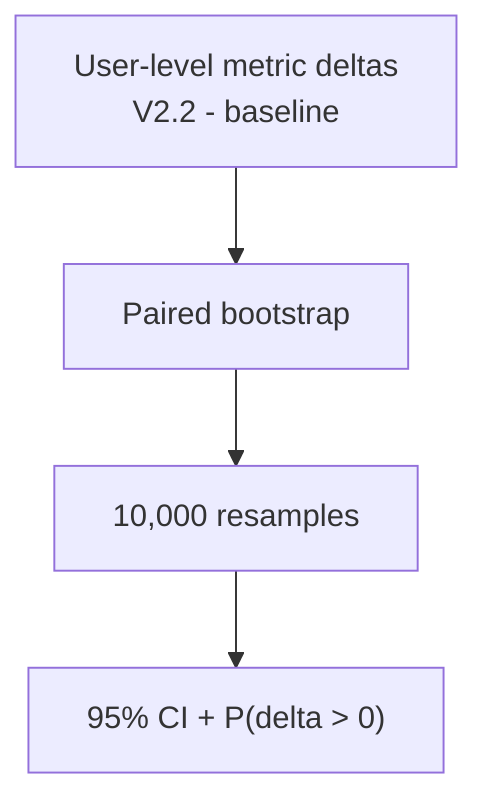

### Thiết kế

- Unit bootstrap: test user.
- Samples: 10,000.
- Statistic: mean user-level delta.
- So sánh:
  - ML-20M: V2.2 vs M7.
  - ML-1M/Amazon: V2.2 vs best fixed expert.

### Kết quả

| Dataset | Delta NDCG@10 | 95% CI | P(delta > 0) | Kết luận |
|---|---:|---|---:|---|
| ML-20M | +0.002664 | [0.001754, 0.003582] | 1.0000 | Reliable gain |
| Amazon | +0.003624 | [0.003015, 0.004261] | 1.0000 | Reliable gain |
| ML-1M | +0.000110 | [-0.001237, 0.001449] | 0.5688 | Neutral |

Hộp kết luận:

> Claim đáng tin là ML-20M và Amazon. ML-1M chỉ dùng làm stability/neutral evidence.

## 10. V2.5 leave-one-seed-out

### Câu hỏi

Weight V2.2 có phải fit vào chính seed test hay không?

### Kiến trúc

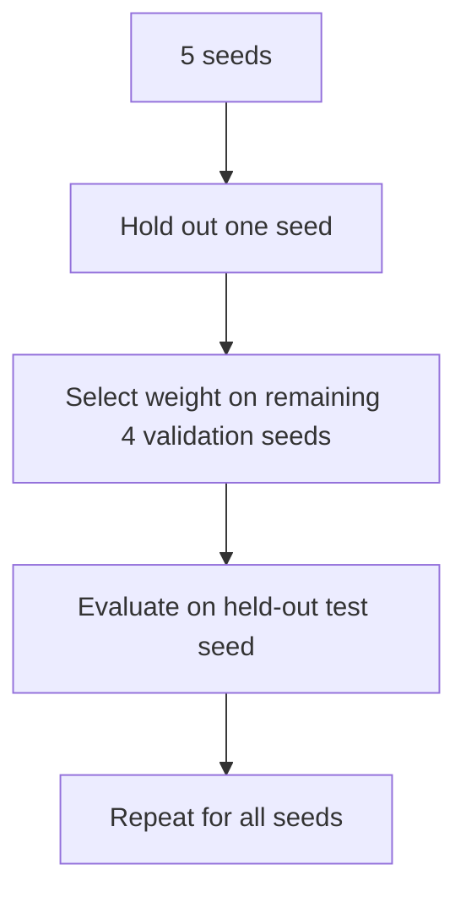

### Thiết kế

Mỗi lần bỏ một seed khỏi quá trình chọn weight, sau đó test trên seed bị bỏ ra.
Đây là robustness check mạnh hơn V2.2 gốc.

### Kết quả

| Dataset | LOSO NDCG@10 | Best Expert | Delta | Difference vs V2.2 |
|---|---:|---:|---:|---:|
| Amazon | 0.076577 | 0.072953 | +0.003624 | +0.000000 |
| ML-20M | 0.119700 | 0.117462 | +0.002238 | -0.000426 |
| ML-1M | 0.194945 | 0.194915 | +0.000030 | -0.000079 |

### Diễn giải

Amazon cực kỳ ổn định: mọi held-out fold đều chọn `(0.00, 0.60, 0.40)`.
ML-20M có weight dao động hơn nhưng pattern ổn định: M7-dominant + một ít
regularizer signal.

## 11. V2.4 oracle gap

### Câu hỏi

Nếu có một oracle chọn action tốt nhất cho từng user, còn bao nhiêu headroom?

### Kiến trúc

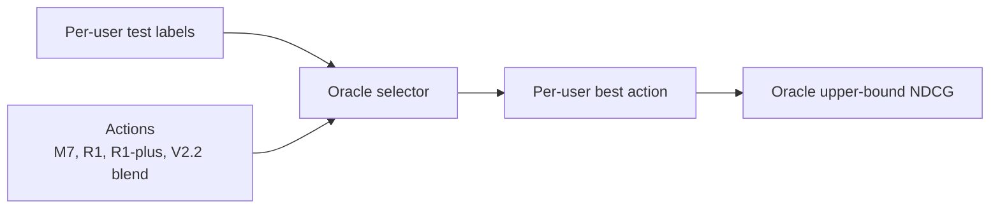

### Thiết kế

- Oracle expert: chọn tốt nhất trong M7/R1/R1-plus theo user.
- Oracle all: chọn tốt nhất trong M7/R1/R1-plus/V2.2 blend.
- Dùng test label nên không deployable.

### Kết quả

| Dataset | V2.2 Blend | Oracle All | Gap |
|---|---:|---:|---:|
| ML-20M | 0.120126 | 0.157996 | +0.037870 |
| ML-1M | 0.195024 | 0.245488 | +0.050463 |
| Amazon | 0.076577 | 0.107637 | +0.031060 |

### Diễn giải

Oracle gap lớn nghĩa là per-user heterogeneity có thật. Nhưng nó không chứng minh
router sẽ thắng, vì oracle dùng thông tin test không có ở inference.

Hộp vấn đề:

> Headroom lớn nhưng label per-user có thể rất noisy. Nếu train router trực tiếp
> trên oracle label validation, test có thể không theo.

## 12. V3 action router

### Câu hỏi

Một classifier nhẹ có recover được một phần oracle gap không?

### Kiến trúc

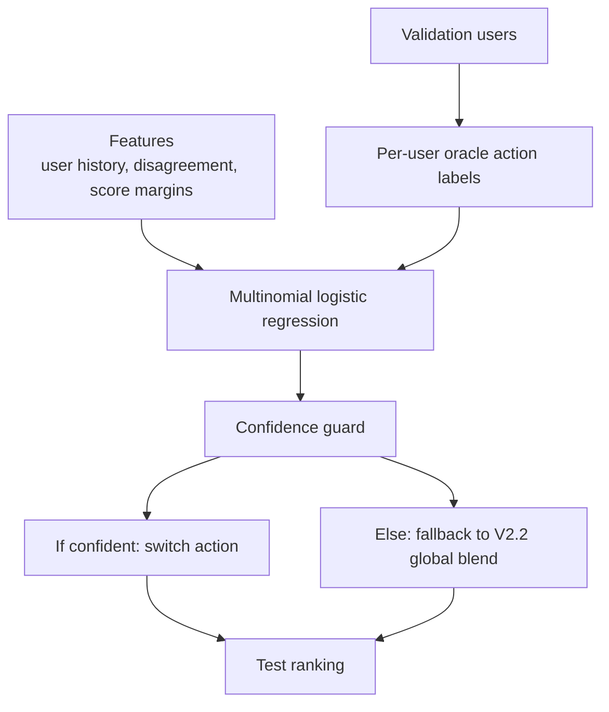

### Thiết kế

- Actions: `m7`, `r1`, `r1plus`, `global_blend`.
- Model: multinomial logistic regression.
- Guard: chỉ switch nếu confidence đủ cao.
- Baseline phải beat: V2.2, không phải best fixed expert.

### Kết quả

| Dataset | V2.2 Blend | V3 Router | Delta vs V2.2 |
|---|---:|---:|---:|
| ML-20M | 0.120126 | 0.119572 | -0.000553 |
| ML-1M | 0.195024 | 0.188125 | -0.006900 |
| Amazon | 0.076577 | 0.076529 | -0.000048 |

### Diễn giải

V3 không thắng V2.2. ML-1M là failure rõ nhất: router switch quá mạnh khỏi global
blend và mất điểm. Đây là negative result quan trọng.

## 13. V3.1 pairwise gain router

### Câu hỏi

Nếu không classify oracle action, mà chỉ học khi nào switch khỏi V2.2 có lợi thì
có an toàn hơn không?

### Kiến trúc

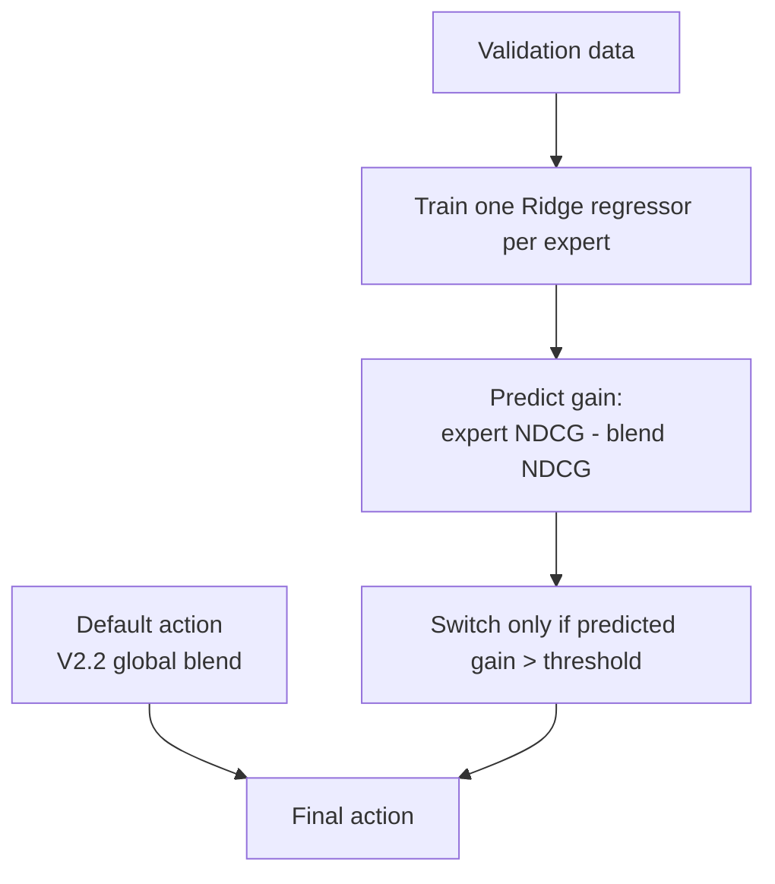

### Thiết kế

- Default: V2.2 global blend.
- Model: Ridge regressors.
- Target: expected gain của từng expert so với blend.
- Switch: chỉ khi predicted gain vượt threshold validation.

### Kết quả

| Dataset | V2.2 Blend | V3.1 Router | Delta vs V2.2 |
|---|---:|---:|---:|
| ML-20M | 0.120126 | 0.116966 | -0.003160 |
| ML-1M | 0.195024 | 0.192643 | -0.002381 |
| Amazon | 0.076577 | 0.076188 | -0.000389 |

### Diễn giải

Regression cũng không giải quyết được vấn đề. Dự đoán gain trên validation không
ổn định sang test. Vấn đề sâu hơn là feature/label hiện tại chưa đủ tin cậy cho
per-user adaptation.

## 14. V4 segment-level blend

### Câu hỏi

Nếu per-user router quá noisy, segment-level blend có an toàn hơn không?

### Kiến trúc

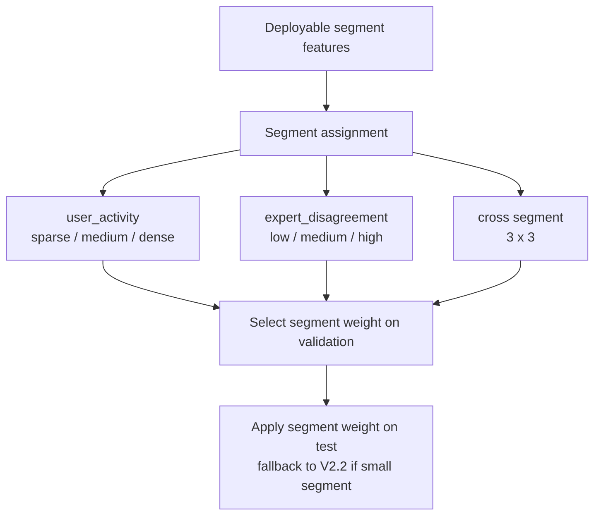

### Thiết kế

- Segment chỉ dùng feature có tại ranking time.
- Weight chọn trên validation.
- Segment nhỏ fallback về V2.2.
- So sánh với V2.2 global blend.

### Kết quả

| Dataset | Best V4 Variant | V4 NDCG@10 | V2.2 | Delta vs V2.2 |
|---|---|---:|---:|---:|
| Amazon | expert_disagreement | 0.076611 | 0.076577 | +0.000034 |
| ML-20M | user_activity_x_expert_disagreement | 0.119249 | 0.120126 | -0.000877 |
| ML-1M | expert_disagreement | 0.193918 | 0.195024 | -0.001106 |

### Diễn giải

V4 gần hơn với deployable adaptation, nhưng vẫn chưa thay thế được V2.2.
Amazon có gain rất nhỏ, chưa đủ claim nếu không có significance. ML-20M và ML-1M
giảm so với global blend.

Hộp kết luận:

> V2.2 đang hoạt động như một regularized solution mạnh. Thêm degrees of freedom
> ở segment-level dễ overfit nếu không regularize chặt về global prior.

## 15. Cross-domain readiness: phần còn thiếu cho hướng 2

### Câu hỏi

Muốn biến kết quả hiện tại thành hướng 2 đúng nghĩa, cần gì tiếp?

### Kiến trúc mong muốn

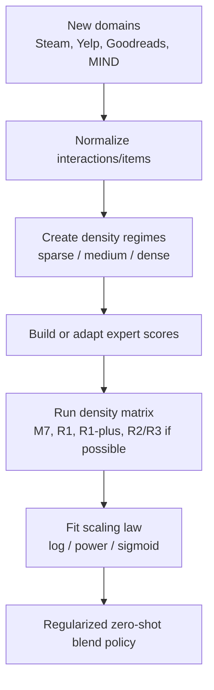

### Trạng thái hiện tại

| Domain | Status | Ý nghĩa |
|---|---|---|
| Steam | raw data downloaded, smoke passed, density export success | sẵn sàng cho matrix smoke |
| Yelp | chưa download/export | first-wave sau Steam |
| Goodreads | second wave | hữu ích nhưng lớn |
| MIND | later protocol branch | protocol khác full-catalog ranking |

Steam hiện có 3 k-core regimes:

| Regime | Users | Items | Interactions | Density |
|---|---:|---:|---:|---:|
| sparse | 29,086 | 7,189 | 1,992,520 | 0.00952906 |
| medium | 27,593 | 6,089 | 1,974,542 | 0.01175226 |
| dense | 24,058 | 4,744 | 1,904,136 | 0.01668375 |

### Diễn giải

Steam đã đủ để làm readiness/density-design story, nhưng chưa đủ để claim
cross-domain density law vì chưa có expert results trên các regime đó.

## 16. Bảng tổng hợp từng thí nghiệm

| Version | Kiến trúc | Kết quả | Vai trò trong báo cáo |
|---|---|---|---|
| V1/DTS | hard threshold theo density | diagnostic, chưa main | motivation/baseline |
| V2 cache | precompute expert scores | hạ tầng thành công | reproducibility/compute efficiency |
| V2/V2.1 | validation-selected soft blend | có tín hiệu nhưng per-seed overfit | bước chuyển từ hard sang soft |
| V2.2 | dataset-level global blend | thắng ML-20M/Amazon, ML-1M neutral | main method |
| V2.2 segments | phân tích theo user/item/disagreement | giải thích sparse-user và expert complement | mechanism evidence |
| V2.3 | paired user bootstrap | ML-20M/Amazon significant | reliability evidence |
| V2.5 | leave-one-seed-out | Amazon rất ổn, ML-20M vẫn dương | robustness evidence |
| V2.4 | oracle per-user upper bound | gap lớn | future-work motivation |
| V3 | logistic action router | thua V2.2 | negative diagnostic |
| V3.1 | pairwise gain router | thua V2.2 | negative diagnostic |
| V4 | segment-level blend | Amazon tiny gain, dataset khác giảm | regularization lesson |
| Cross-domain Steam | readiness/export | sẵn sàng smoke matrix | next phase for hướng 2 |

## 17. Điều có thể claim với team

### Claim mạnh

1. Một lớp soft blend nhẹ trên frozen expert scores cải thiện ML-20M và Amazon.
2. Không cần train lại base recommenders.
3. Bootstrap và LOSO ủng hộ gain trên ML-20M/Amazon.
4. ML-20M cần M7-dominant blend; Amazon cần R1/R1-plus blend.
5. Adaptive routing có oracle headroom nhưng naive routers hiện tại không recover
   được headroom đó.

### Claim phải nói cẩn thận

1. ML-1M là neutral/stability, không phải significant gain.
2. V3/V3.1/V4 không phải method chính.
3. Cold-item improvement chưa đủ chắc.
4. Cross-domain density law chưa được chứng minh thêm, vì Steam/Yelp chưa có full
   expert matrix.

### Không nên claim

1. "Router thắng V2.2."
2. "Hướng 2 đã hoàn thành."
3. "Scaling law sigmoid/power đã được xác nhận."
4. "Selector zero-shot đã generalize cross-domain."

## 18. Kết luận chiến lược

Kết quả hiện tại đủ mạnh để viết một section thí nghiệm hoàn chỉnh cho thesis/report:

> Dataset-level soft expert composition is a strong deployable meta-layer over
> frozen LLM-enhanced recommenders.

Nhưng nếu muốn nâng thành hướng 2 đúng nghĩa, cần thêm cross-domain matrix:

1. chạy Steam matrix smoke trước;
2. có ít nhất 3 density regimes;
3. chạy 3 seeds để kiểm tra pipeline;
4. nếu coherent, mở lên 5 seeds;
5. thêm Yelp làm held-out domain thứ hai;
6. sau đó mới fit `log / power / sigmoid` hoặc học regularized density-conditioned
   blend policy.

Khuyến nghị cuối:

> Dừng tối ưu threshold/router hiện tại. Giữ V2.2 làm main result. Dùng V3/V4 làm
> negative evidence để biện minh rằng method tương lai phải regularized và cross-
> domain. Bước tiếp theo không phải train router mới, mà là chạy Steam density
> matrix smoke.

