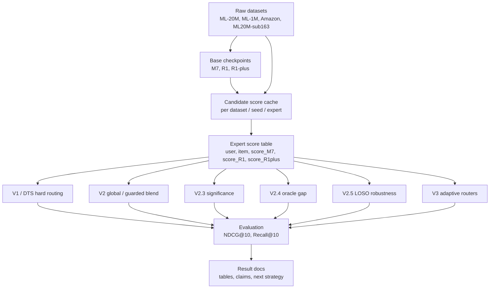
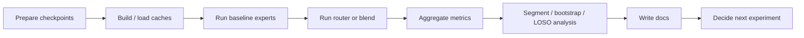
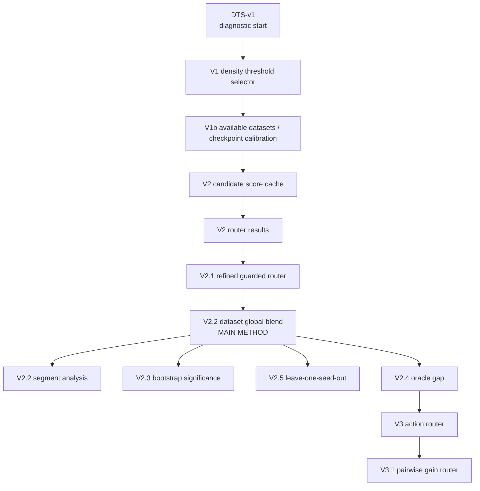

# Tong Quan He Thong Va Thiet Ke Thi Nghiem

Date: 2026-06-01

Tai lieu nay gom lai toan bo nhanh thi nghiem trong `extend_research`: kien truc he
thong, dong du lieu, muc tieu tung version, ket qua chinh va nhan xet cuoi.

## 1. Muc Tieu Tong The

Bai toan khong phai train lai cac base recommender M7, R1, R1-plus. Muc tieu la
xay dung lop mo rong nam tren cac expert da co:

- dung checkpoint/best model cua M7, R1, R1-plus;
- sinh hoac nap candidate score cache cho tung dataset/seed;
- hoc cach chon, tron, hoac phan tich expert nao nen duoc tin hon;
- danh gia bang NDCG@10, Recall@10 va cac phan tich theo user/item/seed.

Ket luan hien tai: **V2.2 dataset-level global blend** la phuong an tot nhat de
bao cao chinh, vi no co gain ro tren ML-20M va Amazon, on dinh qua bootstrap/LOSO,
va khong can train lai M7/R1/R1-plus.

## 2. So Do Kien Truc He Thong

Giai thich nhanh:

- `Raw datasets`: tap interaction va split cua tung benchmark.
- `Base checkpoints`: model da train san, khong thay doi trong cac thi nghiem nay.
- `Candidate score cache`: diem cua tung expert tren candidate item; day la lop du
  lieu quan trong nhat de chay nhanh cac router/blend.
- `Routing/blending layer`: lop nghien cuu moi, nam tren expert score.
- `Evaluation`: tinh metric va phan tich co y nghia thong ke.
- `Result docs`: moi lan them thi nghiem phai ghi lai ket qua, de tranh mat context.

## 3. Dong Xu Ly Thi Nghiem

Nguyen tac:

- Neu chi thay doi cach chia user/item/temperature/cold-warm, **khong train lai
  M7/R1/R1-plus**.
- Neu chi hoc weight/router tren score cache, day la train lop meta, khong phai
  train lai expert.
- Ket qua co the bao cao manh khi no vuot best expert va co bootstrap/robustness
  ung ho.

## 4. Ban Do Cac Thi Nghiem

## 5. Vai Tro Tung Nhom Thi Nghiem

| Nhom | Vai tro | Ket luan |
|---|---|---|
| DTS-v1 / V1 | Kiem tra hard routing theo density/threshold | Co ich de mo duong, nhung chua phai ket qua chinh |
| V1b | Kiem tra dataset/checkpoint nao san sang | Xac dinh ML-20M, ML-1M, Amazon du dieu kien chay |
| V2 cache | Tao lop score cache de chay nhanh routing/blending | Bat buoc cho cac thi nghiem sau |
| V2 / V2.1 | Thu router co guard/refinement | Chua on dinh bang global blend |
| V2.2 | Hoc mot bo weight `(M7, R1, R1-plus)` cho tung dataset | Ket qua chinh hien tai |
| V2.2 segments | Giai thich V2.2 giup o dau | ML-20M giup sparse user; Amazon giup R1/R1-plus complement |
| V2.3 | Bootstrap paired theo user | ML-20M va Amazon dang tin; ML-1M neutral |
| V2.4 | Oracle gap | Co headroom lon cho adaptive routing, nhung chi la upper bound |
| V2.5 | Leave-one-seed-out robustness | Amazon rat on dinh; ML-20M van duong; ML-1M neutral |
| V3 / V3.1 | Hoc adaptive router tu oracle/gain labels | Chua vuot V2.2, dung lam diagnostic/future work |

## 6. Ket Qua Chinh

### V2.2 Dataset-Level Global Blend

Cong thuc:

`score(u, i) = w_M7 * s_M7(u, i) + w_R1 * s_R1(u, i) + w_R1plus * s_R1plus(u, i)`

| Dataset | Weight `(M7, R1, R1-plus)` | V2.2 NDCG@10 | Best Expert | Delta |
|---|---|---:|---:|---:|
| ML-20M | `(0.70, 0.15, 0.15)` | 0.120126 | 0.117462 | +0.002664 |
| ML-1M | `(0.00, 0.60, 0.40)` | 0.195024 | 0.194915 | +0.000110 |
| Amazon | `(0.00, 0.60, 0.40)` | 0.076577 | 0.072953 | +0.003624 |

Doc chi tiet: `docs/V2_2_Dataset_Global_Blend.md`

### V2.3 Bootstrap Significance

| Dataset | Delta NDCG@10 | 95% CI | P(delta > 0) | Nhan xet |
|---|---:|---|---:|---|
| ML-20M | +0.002664 | [0.001754, 0.003582] | 1.0000 | dang tin |
| Amazon | +0.003624 | [0.003015, 0.004261] | 1.0000 | dang tin |
| ML-1M | +0.000110 | [-0.001237, 0.001449] | 0.5688 | trung tinh |

Doc chi tiet: `docs/V2_3_Bootstrap_Significance.md`

### V2.5 Leave-One-Seed-Out

| Dataset | LOSO NDCG@10 | Best Expert | Delta | Difference vs V2.2 |
|---|---:|---:|---:|---:|
| Amazon | 0.076577 | 0.072953 | +0.003624 | +0.000000 |
| ML-20M | 0.119700 | 0.117462 | +0.002238 | -0.000426 |
| ML-1M | 0.194945 | 0.194915 | +0.000030 | -0.000079 |

Doc chi tiet: `docs/V2_5_LOSO_Global_Blend.md`

### V2.4 Oracle Gap Va V3 Router

Oracle cho thay van con headroom lon:

| Dataset | V2.2 Blend | Oracle All | Gap |
|---|---:|---:|---:|
| ML-20M | 0.120126 | 0.157996 | +0.037870 |
| ML-1M | 0.195024 | 0.245488 | +0.050463 |
| Amazon | 0.076577 | 0.107637 | +0.031060 |

Nhung V3/V3.1 chua bien headroom do thanh gain deployable:

| Dataset | V2.2 Blend | V3 Action Router | V3.1 Gain Router |
|---|---:|---:|---:|
| ML-20M | 0.120126 | 0.119572 | 0.116966 |
| ML-1M | 0.195024 | 0.188125 | 0.192643 |
| Amazon | 0.076577 | 0.076529 | 0.076188 |

Doc chi tiet:

- `docs/V2_4_Oracle_Gap.md`
- `docs/V3_Action_Router_Initial_Result.md`
- `docs/V3_1_Pairwise_Gain_Router.md`

## 7. Cach Doc Ket Qua De Viet Bao Cao

Nen dua vao bai theo thu tu:

1. Baseline expert M7/R1/R1-plus co han che vi expert tot nhat thay doi theo dataset.
2. Thay vi retrain model, ta dung score cache va hoc lop meta nhe.
3. V2.2 global blend la phuong an don gian nhung hieu qua.
4. Bootstrap cho thay ML-20M va Amazon co gain dang tin.
5. LOSO cho thay weight khong chi fit mot seed rieng le.
6. Segment analysis giai thich gain den tu nhom nao.
7. Oracle gap cho thay adaptive routing con tiem nang.
8. V3/V3.1 that bai la ket qua co gia tri: label per-user hien tai nhieu noise, feature
   chua du tot, nen future work can thiet ke lai router.

## 8. Nhan Xet Cuoi

### Dieu co the claim manh

- V2.2 cai thien ML-20M va Amazon so voi best fixed expert.
- ML-20M nen dung blend M7-dominant `(0.70, 0.15, 0.15)`.
- Amazon nen dung R1/R1-plus blend `(0.00, 0.60, 0.40)`.
- Khong can train lai M7/R1/R1-plus; chi can cache score va hoc weight meta.
- Amazon co robustness rat tot qua LOSO.

### Dieu phai noi can than

- ML-1M khong nen claim la improved; nen viet la neutral/approximately unchanged.
- V3/V3.1 khong phai ket qua chinh, vi deu kem V2.2.
- Oracle gap khong phai ket qua deployable; no chi chung minh upper bound.
- Khong nen claim cold-item improvement neu segment cold/warm con yeu hoac sparse.

### Chien luoc tiep theo

Huong nen lam tiep la giu V2.2 lam main method va dung V3 nhu phan future work co
can cu. Neu muon tiep tuc cai thien, nen uu tien:

1. lam clean hon phan segment/cold-warm de co explanation chac hon;
2. thu router o cap segment thay vi cap user don le;
3. them feature ve uncertainty/disagreement cua expert;
4. chi bao cao V3 neu no vuot V2.2 tren validation va test, khong chi vuot oracle-label accuracy.

