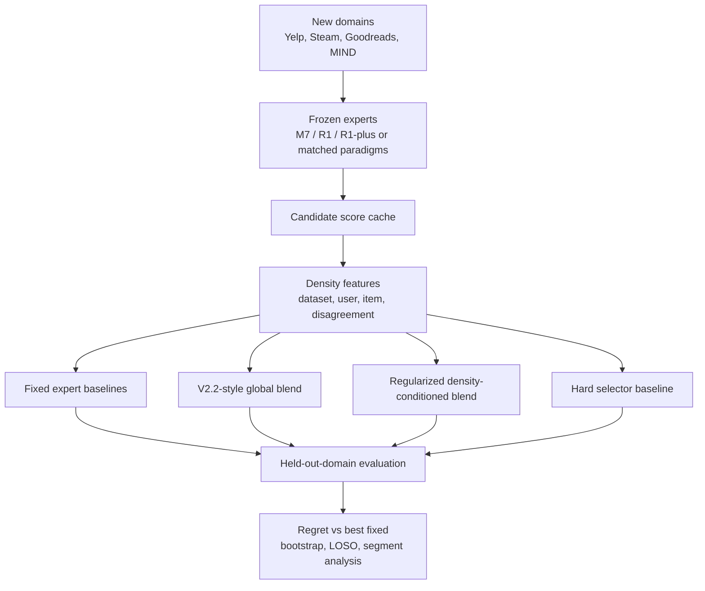

# Next Research Strategy

Date: 2026-06-01

## Short Decision

The next research direction should be:

**Cross-domain density-law replication + regularized zero-shot blend policy.**

This keeps the strongest idea from `Research_Approach.md`:

- ① density-adaptive paradigm selector;
- ② cross-domain replication;

but updates it using the evidence from the current `extend_research` experiments:

- hard threshold selector is closed as the main method;
- unconstrained/adaptive routers V3/V3.1 do not beat V2.2;
- segment-level V4 mostly underperforms V2.2;
- V2.2 global blend is strong because it is simple and regularized.

So the next paper should not be "another threshold selector". It should be:

> The original density law generalizes across domains, and a conservative
> density-conditioned soft blend can reduce regret versus fixed expert choices
> without retraining the base recommenders.

## Why This Direction

`Research_Approach.md` says the strongest top-tier path is ①+②:

| Direction | Original Role |
|---|---|
| ① density-adaptive selector | turns the density law from descriptive into prescriptive |
| ② cross-domain replication | proves the law is not just MovieLens/Amazon-specific |

Our new evidence changes the implementation strategy:

| Evidence From Current Experiments | Implication |
|---|---|
| V2.2 global blend beats best expert on ML-20M and Amazon | soft composition is the right primitive |
| V2.3 bootstrap supports ML-20M/Amazon gains | V2.2 is reportable |
| V2.5 LOSO shows robustness, especially Amazon | global blend is not just seed overfit |
| V3/V3.1 fail to beat V2.2 | per-user adaptive labels are noisy |
| V4 segment blend only gives tiny Amazon gain and hurts ML-20M/ML-1M | naive segment-level adaptation overfits |
| threshold selector is weaker than soft blend | do not continue hard routing as main method |

Therefore, the next method should be conservative:

- start from the V2.2 global blend;
- adapt only when cross-domain evidence supports it;
- regularize any dataset/segment/domain-specific weight toward the global blend;
- evaluate zero-shot on held-out domains.

## Proposed Paper Story

Working title:

**From Density Laws to Robust Expert Composition for LLM-Enhanced Recommendation**

Core claim:

> Prior work characterized how LLM-enhanced recommender paradigms vary with
> interaction density. We test whether this law generalizes across domains and
> whether it can be converted into a deployable, regularized expert-composition
> policy.

This is distinct from the original CIKM/NeurIPS work because:

- it adds new domains;
- it tests held-out-domain prediction;
- it proposes a deployable composition policy;
- it reports negative evidence against naive hard/adaptive routing;
- it does not merely add more cells to the same density matrix.

## Research Questions

### RQ1: Does the density law replicate across domains?

Hypothesis:

> Regularizer-style experts gain more as density decreases, while replacer-style
> methods remain bounded or collapse across sparse regimes.

Needed evidence:

- 3-4 new domains;
- at least 3 density points per domain;
- 5 seeds per point;
- fixed evaluation protocol;
- pre-registered falsification condition.

Candidate domains from `Research_Approach.md`:

| Domain | Why |
|---|---|
| Yelp | service recommendation, sparse, strong review/content signal |
| Steam | game recommendation, medium sparsity, rich metadata |
| Goodreads | book domain, complements Amazon Books |
| MIND | news, extreme sparsity and temporal churn |

Priority order:

1. Yelp;
2. Steam;
3. Goodreads;
4. MIND only if time remains, because news adds temporal complexity.

### RQ2: Can a conservative soft-blend policy beat fixed expert choices?

Hypothesis:

> A regularized density-conditioned blend has lower regret than always using one
> fixed expert, while avoiding the overfitting seen in V3/V4.

Candidate method family:

1. **Global V2.2 baseline**
   - one blend per dataset;
   - current strongest deployable baseline.

2. **Cross-domain prior blend**
   - learn a mapping from dataset-level density features to blend weights;
   - train on source domains;
   - predict weights for held-out domains.

3. **Regularized segment blend**
   - segment by deployable features only;
   - constrain weights close to the dataset/global prior;
   - objective: validation NDCG minus regularization penalty.

4. **Ablated hard selector**
   - include only as a baseline;
   - not the proposed method.

### RQ3: When does adaptation fail?

Hypothesis:

> Adaptation fails when the segment/router labels are too noisy relative to the
> available validation data.

Use current V3/V4 as evidence:

- V3 action router: worse than V2.2;
- V3.1 gain router: worse than V2.2;
- V4 segment blend: tiny Amazon gain, worse ML-20M/ML-1M.

This becomes a useful negative result and explains why the final method must be
regularized.

## System Design

## Experimental Plan

### Phase 0: Close Current Line

Status: mostly done.

Deliverables:

- `Final_Results_For_Report.md`;
- V2.2/V2.3/V2.5/V4 docs;
- clear statement: threshold selector closed as main method.

No more optimization of current threshold selector unless needed as a baseline.

### Phase 1: Cross-Domain Data Readiness

Goal:

Build a readiness table for Yelp, Steam, Goodreads, and MIND.

For each domain, check:

- raw data availability;
- user/item interaction counts;
- metadata/text fields for LLM/content expert;
- temporal split feasibility;
- minimum density points possible;
- cost to generate or reuse profiles;
- whether existing code can export candidate score cache.

Output doc:

- `docs/Cross_Domain_Readiness.md`

Decision gate:

- choose 2 domains first, not all 4.
- recommended first pair: Yelp + Steam.

### Phase 2: Reproduce V2.2-Style Cache Pipeline On New Domains

Goal:

Before testing new methods, prove the score-cache/evaluation pipeline works on
new domains.

Minimum run:

- 2 domains;
- 3 density levels per domain;
- 3 seeds first for smoke run;
- expand to 5 seeds after pipeline is stable.

Metrics:

- NDCG@10;
- Recall@10;
- MRR;
- per-density expert ranking;
- best fixed expert per cell.

Output docs:

- `docs/Cross_Domain_Density_Matrix_V1.md`
- `docs/Cross_Domain_Density_Matrix_Analysis.md`

Decision gate:

- If density law does not replicate at all, pivot to evidence paper/negative result.
- If it replicates, proceed to regularized policy.

### Phase 3: Regularized Density-Conditioned Blend

Goal:

Test whether density features can predict a soft blend that lowers regret on
held-out domains.

Candidate objective:

`score = blend_ndcg(validation) - lambda * distance(weights, prior_weights)`

Where:

- `prior_weights` can be V2.2 global blend or cross-domain learned prior;
- `lambda` controls how far the method can move from the prior;
- hard selector is only a baseline.

Baselines:

| Baseline | Role |
|---|---|
| best fixed expert in hindsight | strong non-deployable reference |
| M7 only | injection/fixed expert |
| R1 only | regularizer/fixed expert |
| R1-plus only | regularizer/fixed expert |
| V2.2-style global blend | strongest current deployable baseline |
| hard threshold selector | exploratory baseline |
| unregularized segment blend | overfitting baseline |

Evaluation:

- train policy on source domains;
- hold out one entire domain;
- predict weights/policy for held-out domain;
- compare against fixed experts and V2.2-style global blend;
- report regret vs oracle.

Primary success condition:

> The regularized policy beats or matches V2.2-style global blend on most
> held-out domains and reduces regret vs the best fixed expert/oracle.

Stop condition:

> If it cannot beat V2.2-style global blend, report V2.2 as the robust final
> policy and make the paper primarily about cross-domain invariance.

### Phase 4: Robustness And Reporting

Required:

- paired bootstrap;
- leave-one-domain-out;
- leave-one-seed-out;
- density-bucket segment analysis;
- ablation without density features;
- ablation without regularization;
- hard selector comparison.

Useful tables:

1. cross-domain density law matrix;
2. held-out-domain policy result;
3. regret vs oracle;
4. regularized vs unregularized policy;
5. failure cases.

## Immediate Next Step

Do **not** start by training a new router.

Start with:

1. write `Cross_Domain_Readiness.md`;
2. inspect which of Yelp/Steam/Goodreads/MIND is easiest to integrate;
3. choose two domains for a first smoke run;
4. define the exact density levels and expected compute/storage;
5. only then implement the new pipeline.

Recommended first concrete task:

> Build the cross-domain readiness table and pick the first two domains.

## Risk Register

| Risk | Mitigation |
|---|---|
| New domains require too much preprocessing | start with 2 domains, not 4 |
| LLM/profile generation cost grows | reuse existing metadata encoders first; generate profiles only after smoke test |
| density law fails on one domain | pre-register as falsifier; still publishable as boundary evidence |
| regularized policy cannot beat V2.2 | pivot to cross-domain law + robust global blend |
| hard selector looks too trivial | keep it as baseline only |
| adaptive policy overfits | regularize toward global prior and evaluate held-out domains |

## Final Recommendation

The next research should move from:

> "Can we make a better selector on current datasets?"

to:

> "Does the density law generalize across domains, and can a conservative soft
> composition policy exploit it under held-out-domain evaluation?"

This is the best continuation because it respects the salami-slicing constraint,
uses the strongest current result V2.2, and turns the failed threshold/router
experiments into useful evidence for why the next method must be regularized.

